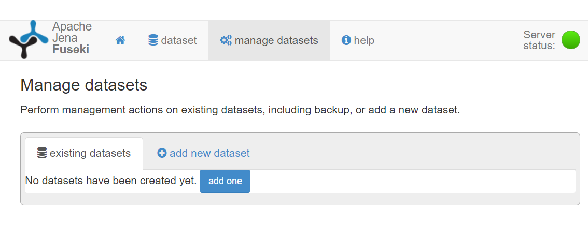
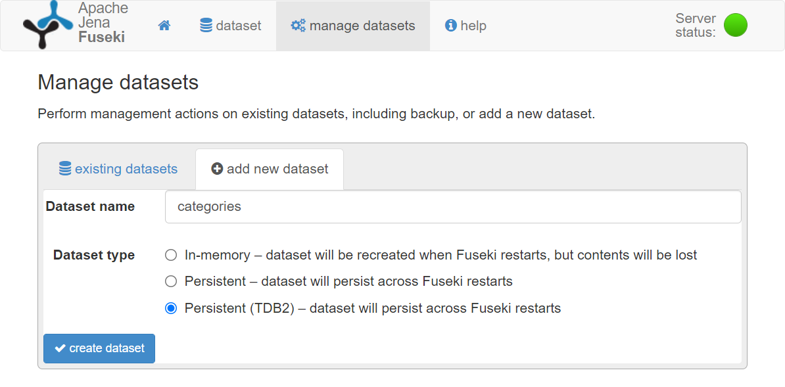
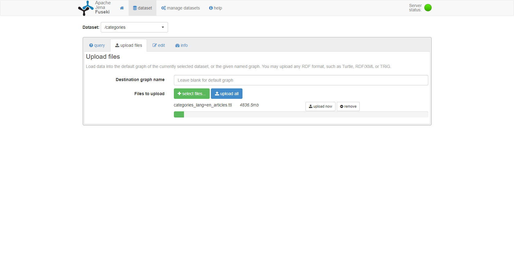
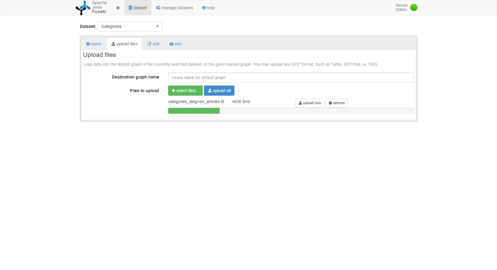
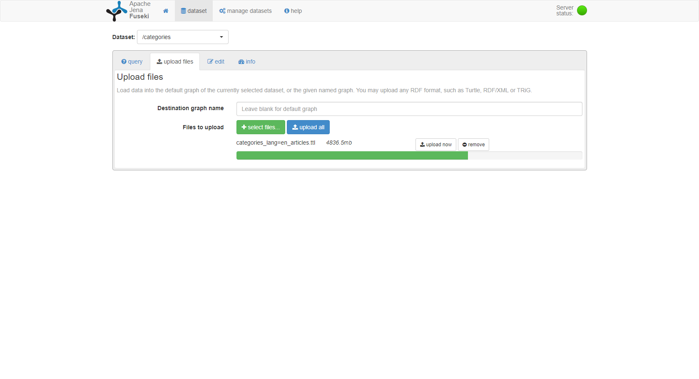
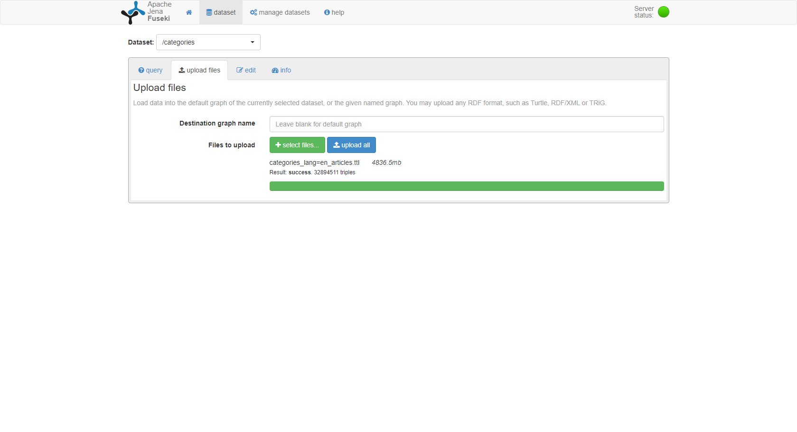
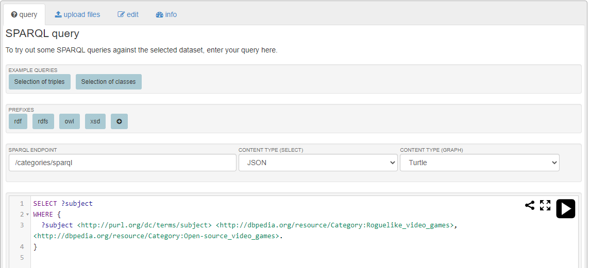

<div align="center">

# Setting up a Local Linked Data Environment on your Laptop

## Alex Michael Berry
### twitter.com/alexmiberry
### github.com/almibe

</div>

---

# Overview

 - Motivation
 - Common Tasks
 - Overview of Applications
 - Overview of Libraries
 - Demo

---

# Goals

 - Explain why local development can be worth the effort
 - Go over some common steps to getting server software running locally
 - Go over some common free & open source software for working with Linked Data

---

# Non-Goals

 - Walk through step by step setting up software
 - Go over all the available software working with Linked Data

---

# Follow Up

Since I'm not able to walk through all the steps and possible hiccups involved,
I've created a `getting-started` channel on the main LD4 slack channel (not the conference one).

https://bit.ly/ld4slack

and join the `getting-started` channel.

---

# Motivation

"Developer experience describes the interactions and feelings that a developer has when working with a body of code in order to meet a specific objective."
&nbsp;&nbsp;&nbsp;&nbsp;-- from https://www.redhat.com/architect/developer-experience

---

# Motivation

 - Out of all the jobs I've had being able to run production code locally has been one of the largest factors in my day to day job satisfaction.
 * (I know that makes me lucky)

---

# Motivation

Spectrum of Local Development

 - Fully local w/ all dependencies 
   - Including databases/searches/any related web services
 - Partially local
   - Main code under development runs locally, might use a shared database or use external web services
 - Fully remote
   - Code is entirely ran on remote servers
   - Possibly not even edited locally

---

# Motivation

Benefits of Local Development

 - Encourages experimentation
 - Less foot stepping
 - Allows for deeper understanding of systems

---

# Motivation

Possible Downsides of Local Development

 - Learning curve
 - Requires up front planning
   - Better Docs
   - Potentially makes configuration harder for original developers (profiles etc)
   - Could split dependencies too (use X in prd, use Y in dev)
 - "It works on my machine."

---

# Common Tasks

Software that is typically ran on a server is likely to have
differences from regular desktop software.

 - Dependencies
 - Configuration
 - Start/Stop Mechanisms

---

# Common Tasks

Dependencies

 - Runtimes
 - Shared library dependencies
 - Databases / search
 - Version control software

---

# Common Tasks

Runtimes

 - Many projects don't ship as a platform specific binary application
 - Applications written in Java, Node.js, and scripting languages like Ruby or Python are common examples
 - Some projects may even require additional external servers or containers
   - Example RDF4J's Server and Workbench require both a Java Runtime Environment and a Servlet Container
   - It used to be very common to require Apache (or similar server) to run some scripting languages as webapps

---

# Common Tasks

Runtimes

 - Things like Docker can greatly help manage requirements like these, but also come with their own issues.
 - I'm not going to focus on Docker
 - Knowing about the things I'm mentioning is still relevant when using Docker
   - For debugging, creating your own Docker Images, or just helping to understand what Docker is doing

---

# Common Tasks

Shared Library Dependencies

 - Many scripting languages make use of shared dependencies that are loaded at runtime
 - These need to be installed before you are able to use them
 - Every programming language will handle this differently
   - External commands
   - Build systems

---

# Common Tasks

Database / Search

 - Some libraries use embedded storage (like Jena's TDB2) and search (like Lucene)
 - Other libraries will require external storage services ranging from other Linked Data stores to traditional relational databases and SOLR for search
 - Most open source databases support installations meant for developers and can be relatively painless to get up and running if they are required

---

# Common Tasks

Version Control Software

 - Not all open source software you want to use has a formal release process in place
 - This is usually only during the initial development of the software
 - Version control software is made for developers so it is well documented and typically easy to install despite usually having a learning curve
 - If the developers want people to still run their software there should be detailed documentation regarding how to get, build, and run software locally

---

# Common Tasks

Configuration

 - Server side software can often require configuration
 - Some projects have defaults or development defaults in place but not all
 - Documentation will have to be referenced by configuration usually takes a couple of common forms
   - Command line arguments
   - External files (sometime passed via command line)
   - Environment variables (it varies how to set these based on OS or shell being used)

---

# Common Tasks

Start/Stop Mechanisms

 - Typically running software like this can be different than running normal desktop applications
 - Cross platform applications usually have scripts that need to be ran (typically .sh on MacOS/Linux or .bat on Windows)
   - For most apps that work this way it's usually easiest to start the script on the command line and exit via your OS/Shell's version of Ctrl-C
 - Databases often hook into OS provided functionality to run in the background automatically on startup (often still use start scripts)
   - Shut down varies per OS and Database some install tray icons, or have admin apps, others are a little more involved
 - Like everything it varies and documentation is very important for helping

---

# Overview of Applications

 - I'm going to mostly focus on Apache JENA's Fuseki server since it is relatively straight forward to setup and work with
 - First I'll mention a couple of other projects to keep in mind
 - Not all of these I've had a chance to play around with, but they all look interesting

---

# Overview of Applications

RDF4J (Formerly OpenRDF Sesame)

 - https://rdf4j.org
 - Eclipse Foundation Project
 - Written in Java and requires having a servlet container installed (like Apache Tomcat)
 - Supports RDF data in the most popular formats and provides support for SPARQL
 - Has baked in storage or can connect to various (mostly proprietary) stores
 - Full text search and GeoSPARQL supported via plugins
 - Also provides a general Java library for working with RDF (similar to Jena)

---

# Overview of Applications

LinkedDataHub

 - https://atomgraph.github.io/LinkedDataHub/
 - Started in 2017, 1.0 in 2020
 - Built on JENA, so it requires Java as well.
 - Apache 2.0 License, same as JENA
 - Looks really interesting but I haven't tried it yet
 - Setup looks well documented but involved and seems to require Docker

---

# Overview of Applications

Protégé

 - https://protege.stanford.edu/
 - Over 20 years of development history, 2-Clause BSD license
 - Slightly different then the other software I've mentioned
 - A desktop and web application for editing ontologies (OWL2)
 - Both are written in Java, the web application uses MongoDB for persistence and requires Apache Tomcat

---

# Overview of Applications

Oxigraph

 - https://github.com/oxigraph/oxigraph
 - Started in 2018 and built in Rust with an Apache 2.0 License
 - Contains a server as well as a library for working with RDF and uses embedded databases (RocksDB and sled)
 - Supports most popular serialization formats and several SPARQL standards
 - Seems to still be mostly focused on developers, however future versions could release platform specific binaries with zero external dependencies

---

# Overview of Applications

Apache JENA and Fuseki

 - Over 20 years of development most of those within the Apache Software Foundation
 - Written in Java
 - Includes an embedded server (Jetty) so slightly easier to work with than an application that requires an external server like Apache Tomcat
 - Provides an internal triple store called TDB2 but can work with relational databases
 - Supports popular serialization formats, SPARQL, OWL, SHACL, and other projects

---

# Using Fuseki

Installing Apache JENA Fuseki

 - Install Java (I recommend either https://sdkman.io or https://adoptopenjdk.net/)
 - Download the latest version from https://jena.apache.org/download/
 - Extract the archive
 - In a command shell run "./fuseki-server" or ".\fuseki-server.bat" on Windows
 - Go to http://localhost:3030 in your browser to make sure it's up

---

# Using Fuseki


---

# Using Fuseki



---

# Using Fuseki



---

# Using Fuseki



---

# Using Fuseki



---

# Using Fuseki


---

# Using Fuseki


---

# Using Fuseki



---

# Using Fuseki


---

# Using Fuseki



---

# Using Fuseki



---

# Using Fuseki


---

# Using Fuseki

 - Obviously Fuseki can do a lot more than that
 - I just wanted to show that the basics are accessible

---

# Overview of Libraries

 - While Linked Data applications which seem to favor a handful languages in practice, just about every programming language has some support for working with Linked Data
 - Libraries typically provide limited support for RDF mostly concerning:
   - Handling serialization formats
   - Having in memory object models/data structures for RDF
   - Calling SPARQL endpoints and handling the results
   - Every library is going have its own set of features

---

# Overview of Libraries

 - Since every language seems to have at least one good RDF library, I'm not going go over them individually
 - Instead I'm just going to focus on Python's RDFLib library

---

# Using LibRDF

 - After installing Python from https://www.python.org/
 - On the command line run `pip install rdflib --user`
 - Then run `pip install sparqlwrapper --user`

---

# Using LibRDF

Now you can run code like the following.

```
import json
import rdflib
from SPARQLWrapper import SPARQLWrapper, JSON

endpoint = SPARQLWrapper("http://localhost:3030/categories/sparql")

endpoint.setReturnFormat(JSON)

endpoint.setQuery("""SELECT ?subject ?predicate ?object
                   WHERE {
                       ?subject ?predicate <http://dbpedia.org/resource/Category:Roguelike_video_games>, <http://dbpedia.org/resource/Category:Open-source_video_games>.
                   }""")
                   
result = endpoint.query().convert()

print(json.dumps(result, indent=4))
```

---

# Using LibRDF

And get results like the following

```
{
  "head": {
    "vars": [
      "subject",
      "predicate",
      "object"
    ]
  },
  "results": {
    "bindings": [
      {
        "predicate": {
          "type": "uri",
          "value": "http://purl.org/dc/terms/subject"
        },
        "subject": {
          "type": "uri",
          "value": "http://dbpedia.org/resource/Angband_(video_game)"
        }
      },
      {
        "predicate": {
          "type": "uri",
          "value": "http://purl.org/dc/terms/subject"
        },
        "subject": {
          "type": "uri",
          "value": "http://dbpedia.org/resource/Cataclysm:_Dark_Days_Ahead"
        }
      },
  ...
```

---

# Using LibRDF

Most libraries will provide similar functionality so for the most part it's up to you which programming language you are most comfortable with, although there are likely some corner cases if you want to use obscure features of RDF.

---

# Conclusion

 - I hope this session has made you more interested in exploring Linked Data locally and that you have some ideas on how to get started!

 - Again feel free to join the `getting-started` channel at https://bit.ly/ld4slack and ask any questions.

<div align="center">

## Alex Michael Berry
### twitter.com/alexmiberry
### github.com/almibe

</div>
