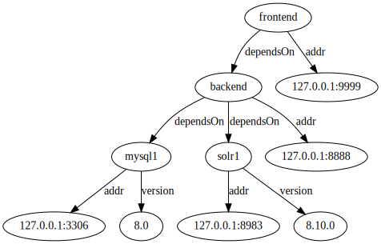

# Storing Ligature's Data Model in Key-Value Databases

Alex Michael Berry
github.com/almibe

---

# Overview

 * Briefly explain Ligature
 * Cover how Hexastore style-architecture and Key-Value Databases fit well with Ligature's Data Model

---

# Background

 * Ligature is a hobby project of mine
 * I've always been interested in using graphs to model information
 * So I wanted something that would allow me to use graphs as casually (and potentially universally) as other data formats
 * Something along the lines of spread sheets for knowledge graphs
   * Not a 1:1 comparison though since although both are quite visual I think graphs need more programmatic access, especially when they are densely linked

---

# Example - Visual



---

# Example - Graphviz Dot

```
digraph G {
 backend  -> mysql1           [ label="dependsOn" ];
 backend  -> solr1            [ label="dependsOn"];
 mysql1   -> "127.0.0.1:3306" [ label="addr" ];
 mysql1   -> "8.0"            [ label="version" ];
 solr1    -> "127.0.0.1:8983" [ label = "addr" ];
 solr1    -> "8.10.0"         [ label="version" ];
 backend  -> "127.0.0.1:8888" [ label = "addr" ];
 frontend -> backend          [ label="dependsOn"];
 frontend -> "127.0.0.1:9999" [ label = "addr" ];
}
```

---

# Example - Serialized Ligature

```
<backend>  <dependsOn> <mysql1>         <1>
<backend>  <dependsOn> <solr1>          <2>
<mysql1>   <addr>      "127.0.0.1:3306" <3>
<mysql1>   <version>   "8.0"            <4>
<solr1>    <addr>      "127.0.0.1:8983" <5>
<solr1>    <version>   "8.10.0"         <6>
<backend>  <addr>      "127.0.0.1:8888" <7>
<frontend> <dependsOn> <backend>        <8>
<frontend> <addr>      "127.0.0.1:9999" <9>
```

---

# Graph Databases

 * Really cool, but not really what I'm looking for
 * Usually client/server focused
 * Rarely embeddable
 * Usually just a single implementation (in Java or C++)
 * Have complicated feature sets that focus on enterprise use cases
 * Often are document databases where a field in a document can be a link to another document

---

# RDF

 * Much closer to what I want
 * I was first introduced to RDF in grad school
 * *Statement* oriented rather than *Document* oriented
 * Has a clear specification with related serialization formats, a query language, and support for schemas ontologies
 * Multiple implementations

---

# RDF

 * Still has some issues for what I want to do
 * Was created for the Semantic Web so its goals don't align with mine
 * Implementations can still be complex to embed and use
 * Each implementation can implement a different subset of the various standards

---

# Ligature

 * Started as an RDF implementation
 * Original intention was to learn more about RDF through practice
 * Realized there were some changes I could make to RDF to make it fit my personal use cases better

---

# Ligature's Data Model

 * A Ligature instance contains a set of named Datasets
 * Datasets contain a set of Statements
 * Statements are represented as following

| Entity     | Attribute  | Value      | Context    |
| ---------- | ---------- | ---------- | ---------- |
| Identifier | Identifier | Identifier | Identifier |
|            |            | Literal    |            |

---

# Identifiers

 * RDF uses IRIs for Identifiers
 * IRIs are defined by https://datatracker.ietf.org/doc/html/rfc3987
 * They are very complicated, and even established libraries like JENA only partially support them
   * https://jena.apache.org/documentation/notes/iri.html
 * Since RDF is focused on the Semantic Web simple identifiers don't make sense
 * Since I want to support local only datasets I'm fine with allowing much simpler identifiers

---

# Identifiers

 * I've decided to support Identifiers as a string that contains only valid URL characters
 * So all valid URLs are Identifiers, but an Identifier doesn't have to be a valid URL
 * Use a URI if you want, use a regular "variable" name if you want, use a (namespaced) atomic id counter if you want, use a (namespaced) nanoid if you want, use a (namespaced) UUID if you want
 * This make Identifiers align with my use case and a lot easier work with in general
 * Also because of the focus on supporting things like nanoid and UUID blank nodes aren't needed

---

# Literals

 * Literals in Ligature are currently pretty minimal
   * Identifier - a Ligature Identifier
   * String - a utf-8 string
   * Integer - a 64-bit integer (Java's longs, Rust's i64, etc)
   * Bytes - a byte array
 * I wanted to start with a minimal set, more might be added

---

# Contexts

 * A big difference from RDF
 * The final position in a quad in Ligature is called the Context
 * Every Statement in a Dataset needs an unique Context
 * This allows for making Statements about Statements
   * Time stamping statements
   * Crediting the source of Statements
   * Noting if a Statement is still valid
   * Pointing to Statements that supersede this one, etc.

---

# Storage

 * I was looking for a storage model that would be flexible and portable
 * I wanted it to be optimized for pattern matches
  * What are all known Attributes for a given Entity?
  * What Entities have this Attribute?
  * What are all of values of the Attribute? 

---

# Key-Value Databases

 * Many types of Key-Value Database exist
 * For this to work best the following requirements should be met
   * Transactional
   * Ordered
   * Scannable
   * Work with byte arrays for keys and values

---

# Key-Value Databases

 * Many Key-Value Databases fit these requirements
   * Native/Embedded - RocksDB (FaceBook), LMDB (OpenLDAP)
   * JVM/Embedded - Xodus (JetBrains), MVStore (H2), MapDB
   * Browser - IndexedDB
   * Distributed - FoundationDB (Apple)

---

# Hexastore


* A 2008 paper comparing different storage methods for RDF triples, arguing for a method that can be adapted to work with Key-Value Databases

---

# Hexastore + Key-Value Databases

  * A simple view of this approach is for every triple {s,p,o} you store six entries in a Key-Value Database, one for each permutation in the key position

  | Key | Value | Note                           |
  | --- | ----- | ------------------------------ |
  | spo |       |                                |
  | sop |       |                                |
  | pso |       | Not needed for my initial case |
  | pos |       |                                |
  | osp |       | Not needed for my initial case |
  | ops |       | Not needed for my initial case |

---

# Hexastore + Key-Value Databases

 * To get this to work correctly all of the values of {s,p,o} should be fixed length ids instead of the actual value the ids could also include type information
 * This requires several lookup tables to covert Subjects to Ids and Ids to Subjects
 * Also each entry should be prefixed with a code saying which type of entry it is (SPO = 1, SOP = 2, PSO = 3, POS = 4, etc.)
 * But since all the values are known fixed size and sorted scanning the database allows for quick lookups

---

# Applying Hexastore to Ligature

 * The basics still apply
 * The Context is the main difference between the two since the models are almost the same with some cosmetic name changes
 * Luckily since the Context is always unique for a given Dataset only one additional row is needs `CEAV`
 * A lookup with a Context involved is essentially an exists check

---

# Ligature

  | Key  | Value | Note                            |
  | ---- | ----- | ------------------------------- |
  | eavc |       |                                 |
  | evac |       |                                 |
  | aevc |       | Not needed for my initial case  |
  | avec |       |                                 |
  | veac |       | Not needed for my initial case  |
  | vaec |       | Not needed for my initial case  |
  | ceav |       | Unique to Ligature              |

---

# Lookup Example

 * Consider you want to find all Statements with a given Attribute and Literal Value
 * Just find the ids for the Attribute and Value and then do a scan for all entires with the given prefix

`STATEMENT_ENTRY + DATASET_ID + AVEC + ATTRIBUTE_ID + VALUE_TYPE_ID + VALUE`

 * You can then decode the matching entries to get all the Entities that make up the matching Statements
 * So this would work for queries like find all the Entities with the firstName "Robert" in the Dataset Employees

---

# Conclusion

 * Ligature tries to be portable thanks to its simple model
 * Key-Value Databases are probably the best fit but Document, Column, and Relational Databases can also be used

---

# Thanks

Alex Michael Berry
github.com/almibe
