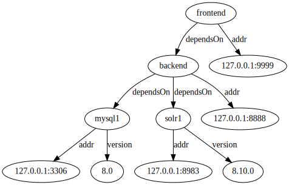

# Introduction to Ligature

Alex Michael Berry
github.com/almibe
twitter.com/alexmiberry

---

# Overview

 * Explain the goals I had that led to starting work on Ligature
 * How Ligature differs from related tools
 * Brief status update and next goals

---

# Overview

 * This is more of a "Hello" introduction and not a teaching introduction
 * This project is still under development so many things are likely to change

---

# Background

 * I've always been interested in using graphs to model information
 * So I wanted something that would allow me to use graphs as casually (and potentially universally) as other data formats
 * Something along the lines of spread sheets for knowledge graphs
   * Not a 1:1 comparison though since although both are quite visual I think graphs need more programmatic access, especially when they are densely linked

---

# Example - Visual



---

# Example - Dot

```
digraph G {
 backend -> mysql1 [ label="dependsOn" ];
 backend -> solr1 [ label="dependsOn"];
 mysql1 -> "127.0.0.1:3306" [ label="addr" ];
 mysql1 -> "8.0" [ label="version" ];
 solr1 -> "127.0.0.1:8983" [ label = "addr" ];
 solr1 -> "8.10.0" [ label="version" ];
 backend -> "127.0.0.1:8888" [ label = "addr" ];
 frontend -> backend [ label="dependsOn"];
 frontend -> "127.0.0.1:9999" [ label = "addr" ];
}
```

---

# Example - Serialized Ligature

```
<backend> <dependsOn> <mysql1> <1>
<backend> <dependsOn> <solr1> <2>
<mysql1> <addr> "127.0.0.1:3306" <3>
<mysql1> <version> "8.0" <4>
<solr1> <addr> "127.0.0.1:8983" <4>
<solr1> <version> "8.10.0" <5>
<backend> <addr> "127.0.0.1:8888" <6>
<frontend> <dependsOn> <backend> <7>
<frontend> <addr> "127.0.0.1:9999" <8>
```

---

# Graph Databases

 * Really cool, but not really what I'm looking for
 * Usually client/server focused
 * Rarely embeddable
 * Usually just a single implementation (in Java or C++)
 * Have complicated feature sets that focus on enterprise use cases
 * Often are document databases where a field in a document can be a link to another document

---

# RDF

 * Much closer to what I want
 * I was first introduced to RDF in class in grad school
 * *Statement* oriented rather than *Document* oriented
 * Has a clear specification with related serialization formats, a query language, and support for schemas ontologies
 * Multiple implementations

---

# RDF

 * Still has some issues for what I want to do
 * Was created for the Semantic Web so its goals don't align with mine
 * Implementations can still be complex to embed and use
 * Each implementation can implement a different subset of the various standards

---

# Ligature

 * Started as an RDF implementation
 * Original intention was to learn more about RDF through practice
 * Realized there were some changes I could make to RDF to make it fit my personal use cases better

---

# Identifiers

 * RDF uses IRIs for Identifiers
 * IRIs are defined by https://datatracker.ietf.org/doc/html/rfc3987
 * They are very complicated, and even established libraries like JENA only partially support them
   * https://jena.apache.org/documentation/notes/iri.html
 * Since RDF is focused on the Semantic Web simple identifiers don't make sense
 * Since I want to support local only datasets I'm fine with allowing much simpler identifiers
   * If you plan on linking Ligature datasets you should know that ahead of time and can use URIs or a different scheme if you want\*
   * If you never plan on linking your dataset then you are free to do whatever\*

\*as long as it is a legal identifier

---

# Identifiers

 * I've decided to support Identifiers as a string that contains only valid URL characters
 * So all valid URLs are Identifiers, but an Identifier doesn't have to be a valid URL
 * Use a URI if you want, use a regular "variable" name if you want, use a (namespaced) atomic id counter if you want, use a (namespaced) nanoid if you want, use a (namespaced) UUID if you want
 * This make Identifiers align with my use case and a lot easier work with in general
 * Also because of the focus on supporting things like nanoid and UUID blank nodes aren't needed

---

# Ligature's Data Model

 * A Ligature instance contains a set of named Datasets
 * Datasets contain a set of Statements
 * Statements are represented as following

| Entity     | Attribute  | Value      | Context    |
| ---------- | ---------- | ---------- | ---------- |
| Identifier | Identifier | Identifier | Identifier |
|            |            | Literal    |            |

---

# Literals

 * Literals in Ligature are currently pretty minimal
   * Identifier - a Ligature Identifier
   * String - a utf-8 string
   * Integer - a 64-bit integer (Java's longs, Rust's i64, etc)
   * Bytes - a byte array
 * I wanted to start with a minimal set, more might be added

---

# Contexts

 * A big difference from RDF
 * The final position in a quad in Ligature is called the Context
 * Every Statement in a Dataset needs an unique Context
 * This allows for making Statements about Statements
 * Time stamping statements, crediting the source of Statements, noting if a Statement is still valid, pointing to Statements that supersede this one, etc.

---

# Status

 * Multiple implementations are being worked on
   * https://github.com/almibe/ligature-rs
   * https://github.com/almibe/ligature-scala
 * A specification is also be developed along side implementations
   * https://github.com/almibe/ligature-specification
 * A scripting language called Wander is being developed as well for interacting with Ligature instances (see above repos)
 * Soon after this focus will shift to schema/ontology support, roughly based on work from RDFS/SHACL/OWL (aka when the real fun starts)

---

# Thanks

Alex Michael Berry
github.com/almibe
twitter.com/alexmiberry
